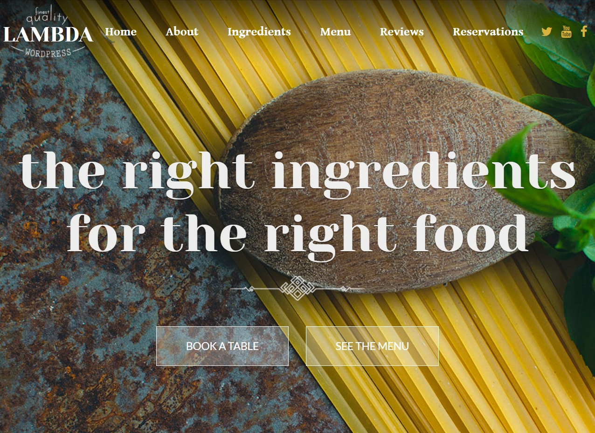
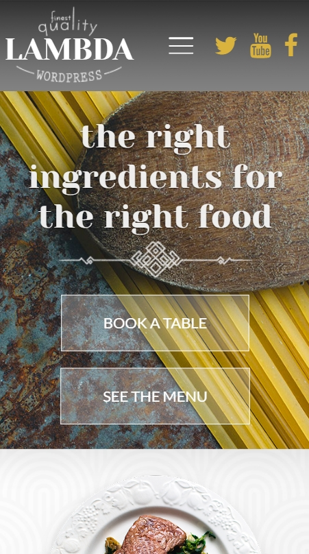
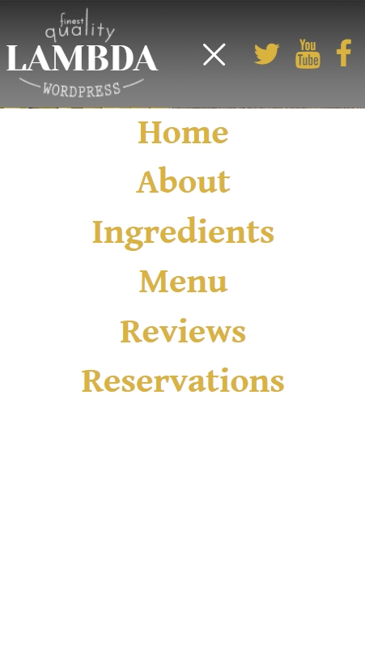

# lambda
Ссылка: https://alexaltrex.github.io/lambda

## Описание
Верстка одностраничного сайта.

## Запуск проекта:
1. Клонирование и запуск: git clone https://github.com/Alexaltrex/lambda.git;
2. Переход в директорию с проектом: cd lambda;
3. Запуск файла index.html;

## Разработка
* Код - JS;
* Верстка - предпроцессор SASS (конкретно SCSS);
* Адаптивный дизайн, поддержка мобильной версии;

